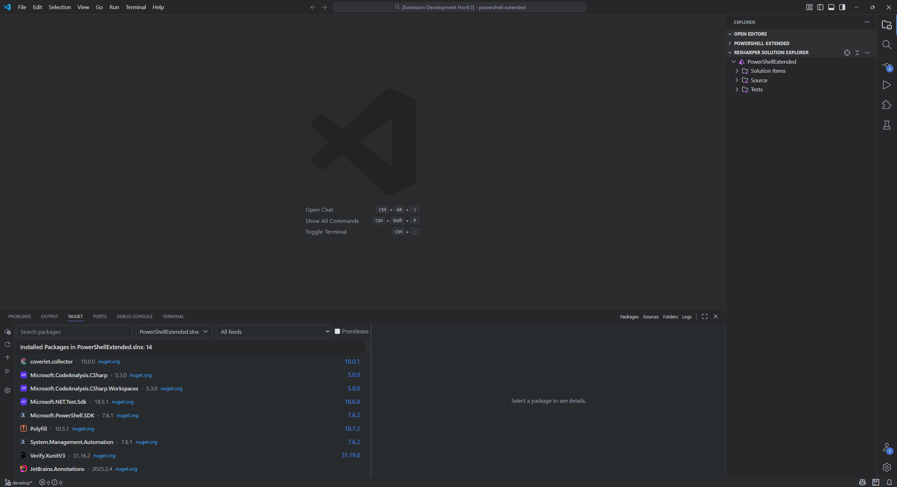
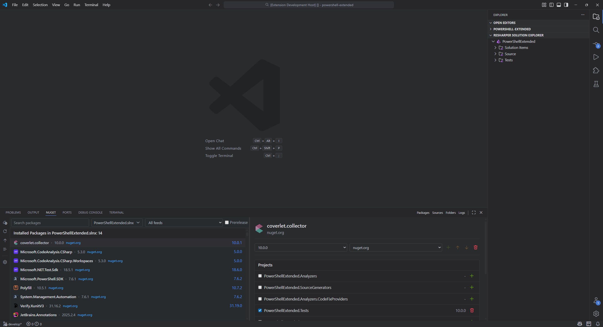
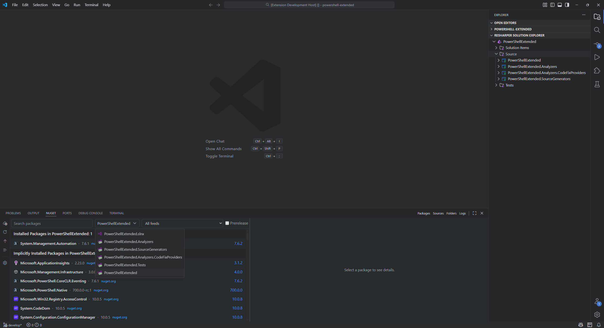
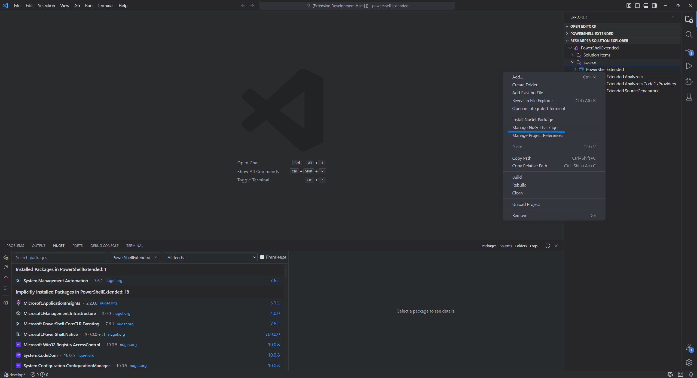
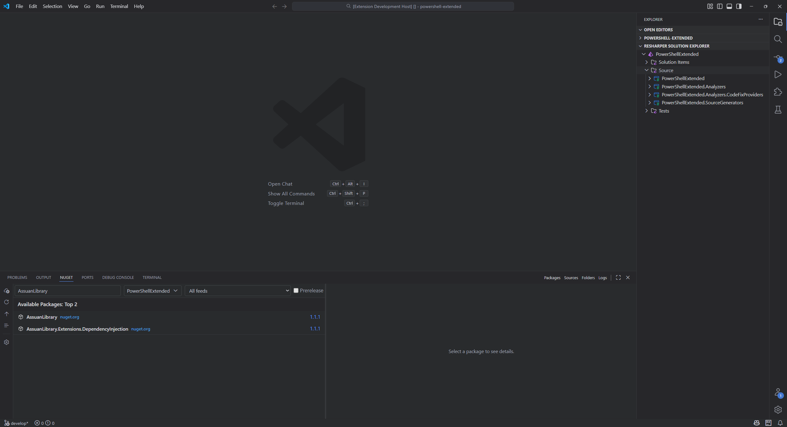
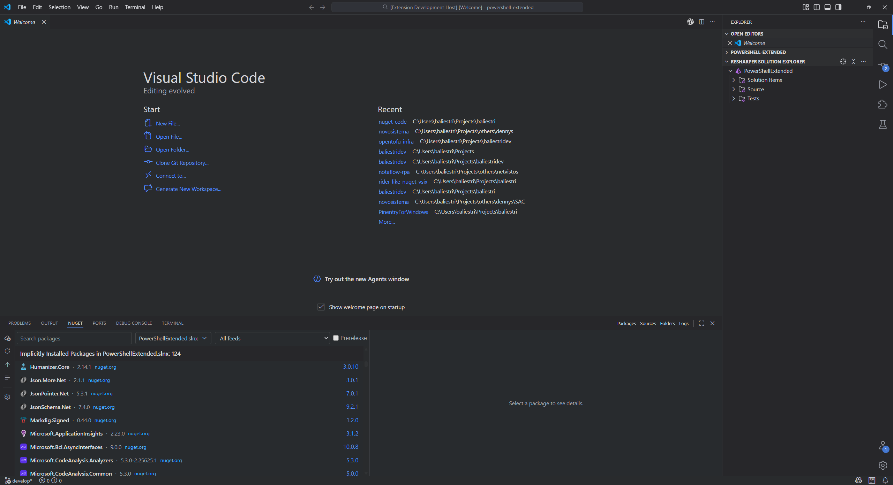
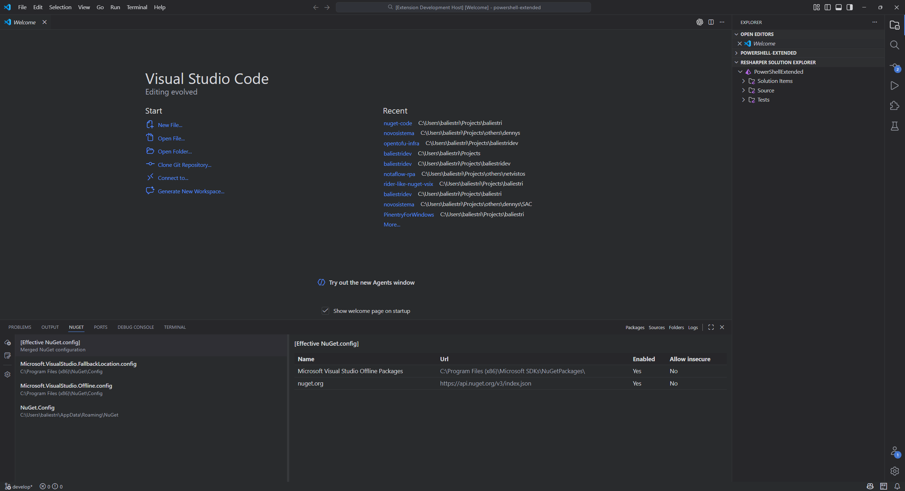
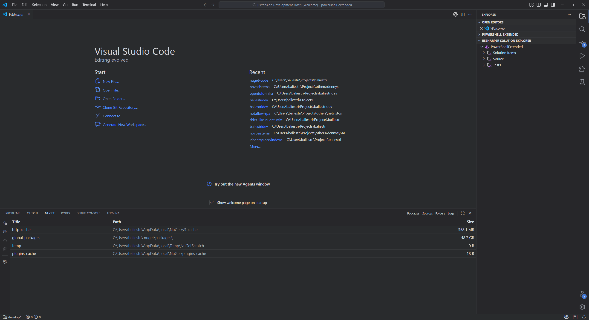
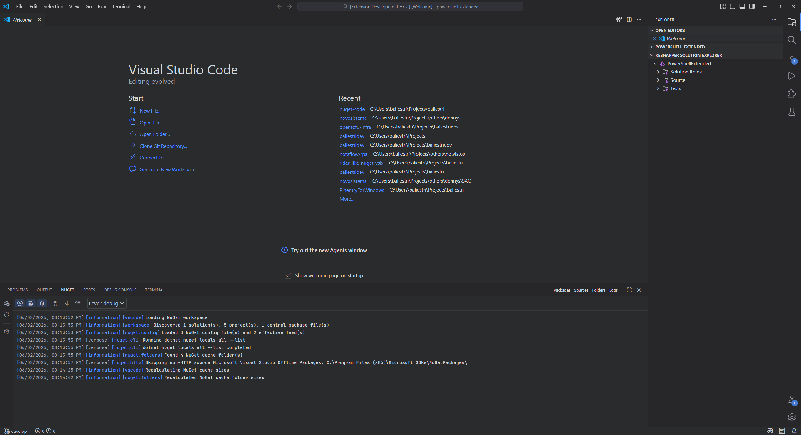

# NuGet Package Manager for VS Code

NuGet Package Manager for VS Code brings a Rider-inspired NuGet package management experience to Visual Studio Code.

It provides a dedicated NuGet panel for .NET workspaces, with package discovery, feed search, package details, project-level package actions, source inspection, cache folder management, and an integrated log view.

> Status: active work in progress. The extension already includes the package manager surface described below, while some Rider-like capabilities, such as editable sources and a Package Manager Console, are still planned.

## Screenshots

### Package Manager





### Projects and Context Menu





### Package Search and Installed Packages





### Sources, Cache Folders, and Logs







## Features

### Rider-Inspired Package Manager

- Dedicated `NuGet` panel with a `NuGet Package Manager` webview.
- Tabs for `Packages`, `Sources`, `Folders`, and `Logs`.
- Tab buttons can be displayed as labels or icons.
- Vertical action rail with tab-specific commands.
- Split package view with package lists on the left and package details on the right.

### Workspace Discovery

- Automatically activates for workspaces containing `.sln`, `.slnx`, `.csproj`, `.fsproj`, or `.vbproj` files.
- Discovers solution and project targets from the current workspace.
- Detects `Directory.Packages.props` files and watches package reference changes.
- Refreshes package data when project files or central package files change.
- Allows switching between solution-level and project-level package targets.

### Package Browsing

- Lists installed top-level packages for the selected target.
- Lists implicitly installed or transitive packages separately.
- Searches available packages from NuGet feeds.
- Supports searching all feeds or a selected feed.
- Supports prerelease package search.
- Shows installed versions, available versions, and feed badges.
- Supports smart and alphabetical sorting for installed and transitive packages.
- Caches package state per workspace, target, feed, search query, and prerelease setting.

### Package Details

- Shows package icon, selected feed, version picker, and source picker.
- Shows package description, authors, tags, published date, and dependency groups.
- Shows deprecated package warnings and alternate package information when available from the feed.
- Allows author and tag clicks to update the package search query.
- Loads and caches package details from NuGet V3 registration data.

### Package Actions

- Restores packages for the selected solution or project using `dotnet restore`.
- Refreshes installed, implicit, available, and outdated package information.
- Upgrades all installed packages with available updates in the selected context.
- Adds packages to one or more selected projects.
- Updates or downgrades packages per selected version.
- Removes packages from one or more selected projects.
- Runs package changes through `dotnet package add` and `dotnet package remove`.
- Shows VS Code progress notifications for package operations.

### NuGet Sources

- Reads NuGet configuration from machine, user, workspace, and extra configured `NuGet.config` paths.
- Builds an effective merged source list.
- Adds `nuget.org` to the effective source list when it is not already configured.
- Shows feed name, URL, enabled state, insecure connection flag, and configuration scope.
- Reloads sources from the action rail.
- Source editing is not implemented yet.

### Feed Access and Authentication

- Searches HTTP NuGet V3 feeds through the feed service index.
- Skips non-HTTP feeds for online search while still checking local package availability for installed packages.
- Supports authenticated feeds through NuGet credential providers.
- Discovers credential providers from configured paths, NuGet environment variables, common plugin folders, and `CredentialProvider.Microsoft`.
- Supports proxy configuration through the extension setting or VS Code's `http.proxy` setting.
- Checks feed health and can prompt for interactive authentication when a feed requires it.

### Cache Folders

- Lists NuGet cache folders from `dotnet nuget locals all --list`.
- Selects cache folders from the table.
- Opens the selected cache folder in VS Code.
- Recalculates cache folder sizes on demand.
- Can calculate cache folder sizes automatically on load when configured.
- Clears selected cache folders.
- Persists calculated cache sizes.

### Logs

- Integrated log tab backed by the extension log buffer.
- Configurable log level and maximum retained entries.
- Toggle timestamp, context, and level columns.
- Filter visible logs by level.
- Enable or disable soft wrap.
- Scroll to end, refresh logs, and clear logs from the UI.

### VS Code Integration

- Command palette command: `Manage NuGet Packages`.
- Explorer context menu entry for solution and project files.
- ReSharper Solution Explorer context menu integration when compatible view items are available.
- Extension settings command from the package manager action rail.

## Requirements

- Visual Studio Code `1.100.0` or newer.
- A .NET workspace containing at least one supported solution or project file.
- `dotnet` available on `PATH`, or configured through `nuget-code.dotnetPath`.
- NuGet credential providers when using authenticated feeds that require them.

## Commands

| Command | Description |
| --- | --- |
| `Manage NuGet Packages` | Opens the NuGet Package Manager view. |
| `Packages` | Switches to the Packages tab. |
| `Sources` | Switches to the Sources tab. |
| `Folders` | Switches to the Folders tab. |
| `Logs` | Switches to the Logs tab. |
| `Restore Packages` | Runs restore for the selected solution or project. |
| `Refresh Packages` | Refreshes package inventory and feed search results. |
| `Upgrade Packages` | Upgrades packages with available updates. |
| `Reload Sources` | Reloads NuGet source configuration. |
| `Recalculate Cache Sizes` | Calculates NuGet cache folder sizes. |
| `Open Cache Folder` | Opens the selected NuGet cache folder. |
| `Clear Selected Caches` | Clears selected NuGet cache folders. |
| `Refresh Logs` | Reloads the log view from the extension log buffer. |
| `Clear Logs` | Clears the integrated log buffer. |
| `Open Settings` | Opens extension settings. |

## Settings

| Setting | Default | Description |
| --- | --- | --- |
| `nuget-code.packageManager.tabButtonStyle` | `labels` | Uses `labels` or `icons` for Package Manager tab buttons. |
| `nuget-code.logLevel` | `information` | Minimum level kept in the Package Manager log buffer. |
| `nuget-code.maxLogEntries` | `1000` | Maximum number of log entries retained by the webview. |
| `nuget-code.defaultFeed` | `__all__` | Default selected feed in the Package Manager. |
| `nuget-code.includePrerelease` | `false` | Includes prerelease packages in feed search. |
| `nuget-code.maxSearchResults` | `100` | Maximum number of packages returned from feed search. |
| `nuget-code.dotnetPath` | `dotnet` | Path to the `dotnet` executable. |
| `nuget-code.nugetPath` | `nuget` | Path to the `nuget` executable. |
| `nuget-code.extraConfigPaths` | `[]` | Additional `NuGet.config` paths included in source discovery. |
| `nuget-code.credentialProviderPaths` | `[]` | Additional NuGet credential provider executable paths. |
| `nuget-code.proxy` | empty | Proxy URL used for NuGet HTTP requests. |
| `nuget-code.useVsCodeProxy` | `true` | Uses VS Code's `http.proxy` when no extension proxy is configured. |
| `nuget-code.calculateCacheSizesOnLoad` | `false` | Calculates NuGet cache folder sizes when the package manager loads. |

## Current Limitations

- NuGet sources are currently read-only in the extension UI.
- Package Manager Console is not implemented yet.
- Package search uses HTTP NuGet V3 feeds; local feeds are used for availability checks where possible.
- Package operations rely on the installed `dotnet` CLI and its behavior for the selected project or solution.

## Development

This repository uses `pnpm` and a workspace-based package structure.

Common commands:

```bash
pnpm install
pnpm run build
pnpm run typecheck
pnpm run lint
pnpm run test
```

Additional commands:

```bash
pnpm run dev
pnpm run format
```

## Project Direction

The goal is not to clone Rider feature-for-feature. The goal is to bring the parts of Rider's NuGet Package Manager experience that make sense in VS Code while fitting VS Code's extension model and .NET tooling constraints.

## License

Licensed under the MIT License. See [LICENSE.md](LICENSE.md) for details.
